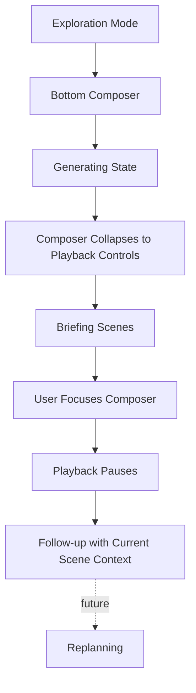

# Briefing Script Architecture

## Scene model

Opening establishes scope; middle scenes represent every required plan step;
closing exposes supported content, uncertainty, verification signals, sources,
and follow-up policy. Content bindings cannot exceed the plan's exact evidence
bindings and every evidence-bearing scene has citation cues.

Visual directives preserve Sprint 10 visual intent. `CameraIntent` describes
global view, regional focus, comparison, route/network tracing, impact path,
overview return, hold, or no motion. It never contains coordinates or timing.
Overlay, chart, and document intents likewise contain semantic IDs and purpose,
not renderer specifications.

## Layout and interaction

Every scene reserves composer, controls, captions, mobile safe area, optional
side panel, and primary visual focus. Manual map interaction pauses scripted
motion and preserves user view until explicit resume.

## Accessibility and fallbacks

Captions, keyboard navigation, screen-reader labels, color-independent
semantics, reduced motion, and static fallback are mandatory. Static mode
allows no camera motion; reduced motion uses minimal or no transitions.

## Validation and fingerprint

Validation covers identity/fingerprints, scene order, opening/closing, maximum
scenes, dependency cycles, plan coverage, content/provenance/citation
integrity, epistemic/visual/camera policy, composer/safe viewport, playback,
interaction, and accessibility.

Fingerprint inputs include plan/context/contract fingerprints, compiler and
preference versions, semantic scene order, bindings, visual/camera/layout
directives, cues, playback, interaction, and accessibility. Generated IDs,
timestamps, warning order, pixels, coordinates, and duration are excluded.

Motion planning, rendering, UI, narration generation, and persistence adapters
remain outside this module.
