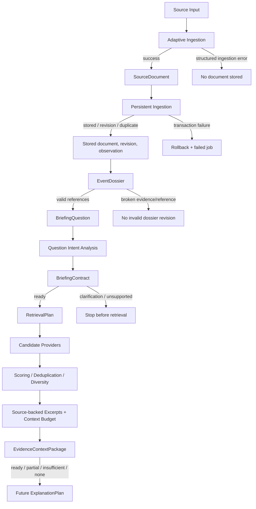

# End-to-End Data Flow



## Provenance chain

```text
ContextItem
→ SourceExcerpt
→ ProvenanceRecord
→ SourceDocument / dossier statement / claim / evidence / data
→ source fingerprint + document/dossier revision + capability observation
→ fixed original input or stored record
```

Every selected item must have an excerpt and matching provenance record.
Missing links fail package validation. SourceDocument excerpt text must be
present in its summary/body source.

## Failure semantics

- Ingestion never returns an invalid SourceDocument.
- Persistence transactions roll back partial writes.
- Dossier validation rejects broken references and invalid classifications.
- Ambiguous/personalized questions stop before retrieval.
- Context never promotes missing evidence to ready and never generates filler.
