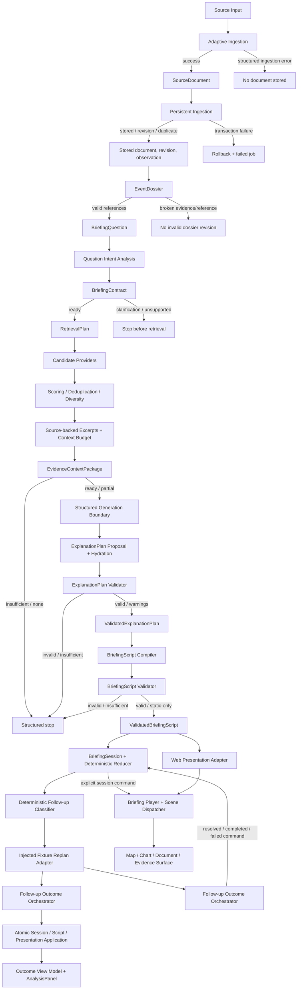

# End-to-End Data Flow

Sprint 14.3B's fixture-only follow-up branch is implemented, browser accepted,
and final complete. Live GPT/search, backend persistence, true append, and a
browser failure fixture remain outside this flow.


```mermaid
flowchart TD
  S["Source Input"] --> I["Adaptive Ingestion"]
  I -->|success| D["SourceDocument"]
  I -->|structured ingestion error| IF["No document stored"]
  D --> P["Persistent Ingestion"]
  P -->|stored / revision / duplicate| R["Stored document, revision, observation"]
  P -->|transaction failure| PF["Rollback + failed job"]
  R --> E["EventDossier"]
  E -->|valid references| Q["BriefingQuestion"]
  E -->|broken evidence/reference| EF["No invalid dossier revision"]
  Q --> A["Question Intent Analysis"]
  A --> C["BriefingContract"]
  C -->|ready| RP["RetrievalPlan"]
  C -->|clarification / unsupported| CF["Stop before retrieval"]
  RP --> CP["Candidate Providers"]
  CP --> SD["Scoring / Deduplication / Diversity"]
  SD --> X["Source-backed Excerpts + Context Budget"]
  X --> EC["EvidenceContextPackage"]
  EC -->|ready / partial| GP["Structured Generation Boundary"]
  EC -->|insufficient / none| ES["Structured stop"]
  GP --> EP["ExplanationPlan Proposal + Hydration"]
  EP --> EV["ExplanationPlan Validator"]
  EV -->|valid / warnings| VP["ValidatedExplanationPlan"]
  EV -->|invalid / insufficient| ES["Structured stop"]
  VP --> SC["BriefingScript Compiler"]
  SC --> SV["BriefingScript Validator"]
  SV -->|valid / static-only| VS["ValidatedBriefingScript"]
  SV -->|invalid / insufficient| ES
  VS --> WA["Web Presentation Adapter"]
  VS --> BS["BriefingSession + Deterministic Reducer"]
  BS --> FU["Deterministic Follow-up Classifier"]
  FU --> RA["Injected Fixture Replan Adapter"]
  RA --> AO["Follow-up Outcome Orchestrator"]
  AO --> AA["Atomic Session / Script / Presentation Application"]
  AA --> UI["Outcome View Model + AnalysisPanel"]
  RA --> FO["Follow-up Outcome Orchestrator"]
  FO -->|resolved / completed / failed command| BS
  BS -->|explicit session command| BP
  WA --> BP["Briefing Player + Scene Dispatcher"]
  BP --> F["Map / Chart / Document / Evidence Surface"]
```

## Provenance chain

```text
BriefingScene
→ SceneContentBinding
→ ExplanationPlan EvidenceBinding
→ ContextItem
→ SourceExcerpt + ProvenanceRecord
→ SourceDocument / dossier statement / claim / evidence / data
→ source fingerprint + document/dossier revision + capability observation
→ fixed original input or stored record
```

Every selected item must have an excerpt and matching provenance record.
Missing links fail package validation. SourceDocument excerpt text must be
present in its summary/body source.

## Failure semantics

- Ingestion never returns an invalid SourceDocument.
- Persistence transactions roll back partial writes.
- Dossier validation rejects broken references and invalid classifications.
- Ambiguous/personalized questions stop before retrieval.
- Context never promotes missing evidence to ready and never generates filler.
- Generation treats evidence as data, allows only closed-world references, and
  never promotes an invalid proposal to a validated plan.
- Script compilation never returns a draft as renderer-ready and enforces the
  contract scene budget, evidence closure, static fallback, and accessibility.
