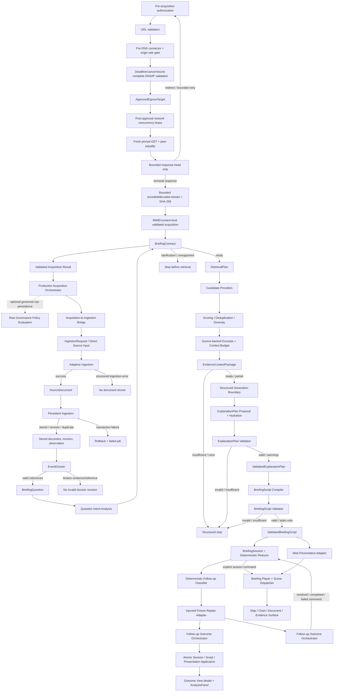

# End-to-End Data Flow

Sprint 14.3B's fixture-only follow-up branch is implemented, browser accepted,
and final complete. Live GPT/search, backend persistence, true append, and a
browser failure fixture remain outside this flow.

The Interactive Briefing Milestone 02 audit and user-operated Chrome acceptance
are complete. This is the fixture-only Sprint 10–14 baseline; no live
GPT/search/backend integration is implied.


```mermaid
flowchart TD
  PA["Pre-acquisition authorization"] --> UV["URL validation"]
  UV --> RG["Pre-DNS connector + origin rate gate"]
  RG --> TV["Deadline/cancel-bound complete DNS/IP validation"]
  TV --> ET["ApprovedEgressTarget"]
  ET --> CG["Post-approval network concurrency lease"]
  CG --> PT["Fresh pinned GET + peer equality"]
  PT --> RH["Bounded response head only"]
  RH -->|redirect / bounded retry| PA
  RH -->|terminal response| BR["Bounded encoded/decoded stream + SHA-256"]
  BR --> MV["MIME/content-kind validated acquisition"]
  MV --> C["SourceConnector adapter"]
  C --> AQ["Validated Acquisition Result"]
  AQ --> O["Production Acquisition Orchestrator"]
  O -. "optional governed raw persistence" .-> G["Raw Governance Policy Evaluation"]
  O --> B
  B["Acquisition-to-Ingestion Bridge"]
  B --> S["IngestionRequest / Direct Source Input"]
  S --> I["Adaptive Ingestion"]
  I -->|success| D["SourceDocument"]
  I -->|structured ingestion error| IF["No document stored"]
  D --> P["Persistent Ingestion"]
  P -->|stored / revision / duplicate| R["Stored document, revision, observation"]
  P -->|transaction failure| PF["Rollback + failed job"]
  R --> E["EventDossier"]
  E -->|valid references| Q["BriefingQuestion"]
  E -->|broken evidence/reference| EF["No invalid dossier revision"]
  Q --> A["Question Intent Analysis"]
  A --> C["BriefingContract"]
  C -->|ready| RP["RetrievalPlan"]
  C -->|clarification / unsupported| CF["Stop before retrieval"]
  RP --> CP["Candidate Providers"]
  CP --> SD["Scoring / Deduplication / Diversity"]
  SD --> X["Source-backed Excerpts + Context Budget"]
  X --> EC["EvidenceContextPackage"]
  EC -->|ready / partial| GP["Structured Generation Boundary"]
  EC -->|insufficient / none| ES["Structured stop"]
  GP --> EP["ExplanationPlan Proposal + Hydration"]
  EP --> EV["ExplanationPlan Validator"]
  EV -->|valid / warnings| VP["ValidatedExplanationPlan"]
  EV -->|invalid / insufficient| ES["Structured stop"]
  VP --> SC["BriefingScript Compiler"]
  SC --> SV["BriefingScript Validator"]
  SV -->|valid / static-only| VS["ValidatedBriefingScript"]
  SV -->|invalid / insufficient| ES
  VS --> WA["Web Presentation Adapter"]
  VS --> BS["BriefingSession + Deterministic Reducer"]
  BS --> FU["Deterministic Follow-up Classifier"]
  FU --> RA["Injected Fixture Replan Adapter"]
  RA --> AO["Follow-up Outcome Orchestrator"]
  AO --> AA["Atomic Session / Script / Presentation Application"]
  AA --> UI["Outcome View Model + AnalysisPanel"]
  RA --> FO["Follow-up Outcome Orchestrator"]
  FO -->|resolved / completed / failed command| BS
  BS -->|explicit session command| BP
  WA --> BP["Briefing Player + Scene Dispatcher"]
  BP --> F["Map / Chart / Document / Evidence Surface"]
```

`IngestionPipeline` and `InputResolver` are materialized-content boundaries,
not network clients. A URL locator alone is rejected with
`SAFE_ACQUISITION_REQUIRED`. `SafeNetworkIngestionService` is the public
URL-to-document composition: it executes the existing safe runtime once,
projects its validated body through `SourceAcquisitionIngestionBridge`, and
passes that content to the pipeline without refetching.

`ProductionAcquisitionOrchestrator` is the authoritative combined application
boundary. It consumes one `SafeNetworkAcquisitionRuntime` result and reuses its
exact decoded bytes and SHA-256 for optional `RawArtifactPersistenceService`,
while the existing validated text projection goes through
`SourceAcquisitionIngestionBridge`. It never refetches, decompresses, decodes,
rehashes normalized content, or regenerates acquisition identity. Redirect and
retry attempts remain network audit events; only the terminal acquisition ID
becomes one acquisition occurrence.

Raw persistence is separately governed and never mandatory for ingestion.
When requested persistence is denied or fails, ingestion may still finish, but
the combined result is a bounded `stage: persistence` partial failure carrying
the distinct persistence and ingestion results. RawArtifact and SourceDocument
lifecycles remain independent.

## Production network authority allowlist

Only these modules perform network I/O:

- `src/source-acquisition-security/pinned-transport.ts`
- `src/source-acquisition-security/response-head-transport.ts`

Three pure validation modules receive a symbol-level exception only for the
named `node:net/isIP` import: `ip-classifier.ts`, `url-validator.ts`, and the
legacy content URL validator `ingestion/url-policy.ts`. They do not receive a
module-level `node:net` permission. Other named symbols, mixed imports,
namespace/default imports, `require`, and dynamic imports fail closed, so these
modules cannot acquire socket authority.

A TypeScript-AST architecture test scans every production TypeScript module in
ingestion, source connectors, safe acquisition, and acquisition orchestration.
Broad low-level modules are permitted only in the two explicit safe transport
files, with a per-file set of modules each transport genuinely uses. Everywhere
else the guard rejects `fetch` references, static or dynamic imports and
`require` aliases of Node HTTP/HTTPS/net/TLS/dgram, and common direct clients,
except for the exact symbol-level `isIP` permissions above. Even broad-authority
files cannot add global fetch or an unapproved client. Test fixture servers are
excluded. Adding a new authority therefore requires a deliberate allowlist and
architecture review.

Acquisition text remains UTF-8-only. Broader charset support is a future
connector concern and does not relax this security boundary.

## Provenance chain

```text
BriefingScene
→ SceneContentBinding
→ ExplanationPlan EvidenceBinding
→ ContextItem
→ SourceExcerpt + ProvenanceRecord
→ SourceDocument / dossier statement / claim / evidence / data
→ source fingerprint + document/dossier revision + capability observation
→ fixed original input or stored record
```

Every selected item must have an excerpt and matching provenance record.
Missing links fail package validation. SourceDocument excerpt text must be
present in its summary/body source.

## Failure semantics

- Every network attempt receives fresh authorization, DNS/IP approval, and an
  isolated pinned connection; redirects and retries never reuse approval.
- Rate quota is consumed before DNS and bounded bucket state fails closed;
  network concurrency is acquired only after target approval.
- A combined-only compatibility gate conservatively holds one active lease
  from pre-DNS admission through response-head completion.
- The overall deadline detaches lifecycle progress from non-abortable DNS;
  late resolver completion is ignored and cannot produce approval or transport.
- Cancellation and finite attempt/overall deadlines stop before the next
  security-sensitive step, while admission leases cover only active attempts.
- Response heads are bounded and privacy-minimized lifecycle failures map into
  the Sprint 17.1 outcome taxonomy.
- Terminal bodies retain the active concurrency lease while Node pipeline
  applies encoded/decoded ceilings, decompression, idle/cancel/deadline checks,
  MIME/content-kind policy, and incremental decoded-byte hashing.
- The connector adapter uses the existing SourceAcquisitionResult and bridge;
  governed durable raw storage is optional and remains a separate Sprint 17.2C
  branch from the same bounded result.
- No ingestion resolver or default pipeline constructor opens a URL. All
  production URL acquisition passes through the approved-target safe runtime.
- Ingestion never returns an invalid SourceDocument.
- Persistence transactions roll back partial writes.
- Dossier validation rejects broken references and invalid classifications.
- Ambiguous/personalized questions stop before retrieval.
- Context never promotes missing evidence to ready and never generates filler.
- Generation treats evidence as data, allows only closed-world references, and
  never promotes an invalid proposal to a validated plan.
- Script compilation never returns a draft as renderer-ready and enforces the
  contract scene budget, evidence closure, static fallback, and accessibility.
- Follow-up and replan results retain operation/start fingerprints; stale or
  mismatched results cannot replace the active Session.
- Same-ID scene changes are detected by semantic fingerprint, and Web
  replacement is committed only after Session, Script, presentation, cursor,
  and surface identities agree.
- Invalid evidence or replacement identity returns a structured failure and
  preserves the prior Script and cursor.
