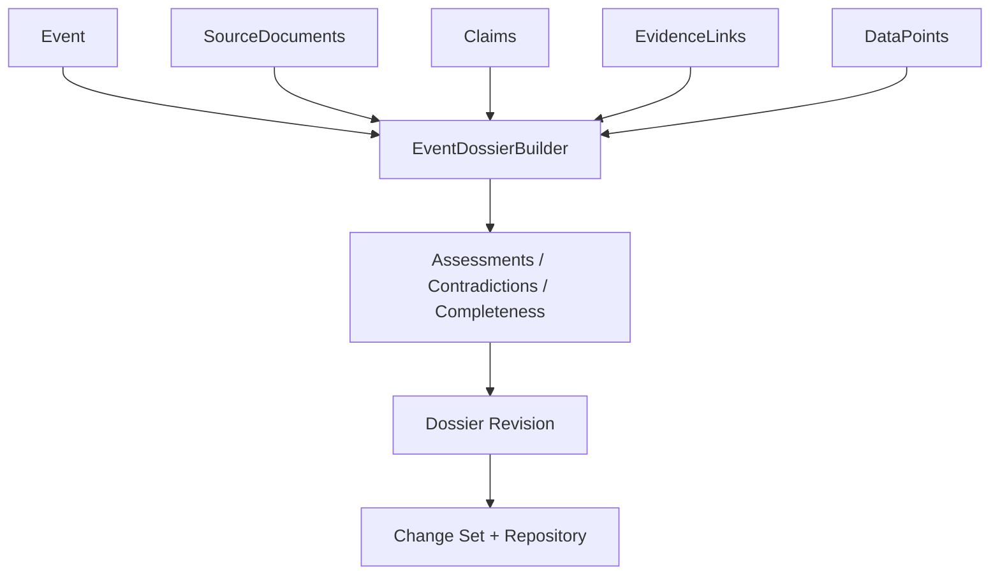

# Event Dossier Architecture

A dossier organizes one Event's evidence, conflicts, uncertainty, history, and
open questions. It references domain records by ID and does not duplicate full
source bodies.

The deterministic builder checks Event membership and reference integrity,
sorts/deduplicates references, assesses Claims from EvidenceLink relations,
detects explicit refutations and same-period numerical conflicts, calculates a
transparent completeness baseline, and compares semantic revisions.

`EventDossierRepository`, `DossierRevisionRepository`, and
`DossierUnitOfWork` have In-Memory and SQLite implementations. Migration 2
stores the latest validated snapshot and immutable revision JSON with optimistic
revision-number conflict detection.

Future AI agents may propose structured Statements through the same validation
boundary. LLM generation, natural-language contradiction detection, UI, and
search are not implemented.
