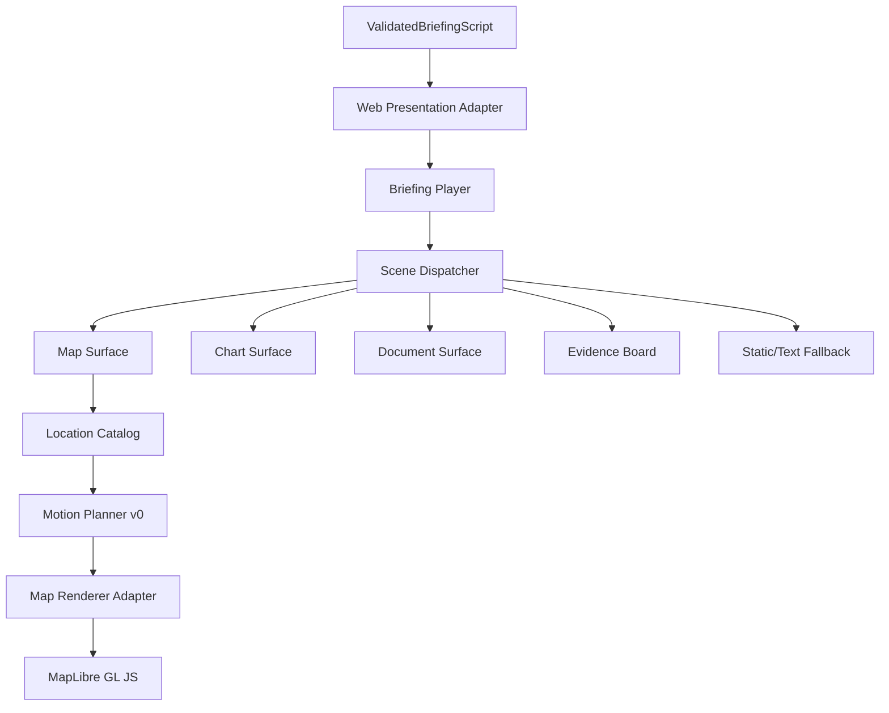

# Interactive Renderer Architecture

The adapter rejects draft/invalid scripts and preserves the script fingerprint,
scene order, evidence references, playback, interaction, and accessibility
policies. The dispatcher renders only the current scene and never invents
facts, sources, locations, DataPoints, verdicts, or probabilities.

The player reducer owns ready/playing/paused/ended/error state, current scene,
speed, animation preference, composer focus, manual-map conflict, and stale
motion IDs. Playback is always user-initiated. Focusing the composer and manual
map interaction pause playback without losing the current scene.

Map failure does not remove captions, navigation, evidence, citations, or
static surfaces. The fake adapter prevents canvas and network use in tests.
MapLibre is initialized only by `MapSurface`, cleaned up on unmount, and does
not leak types into core.
