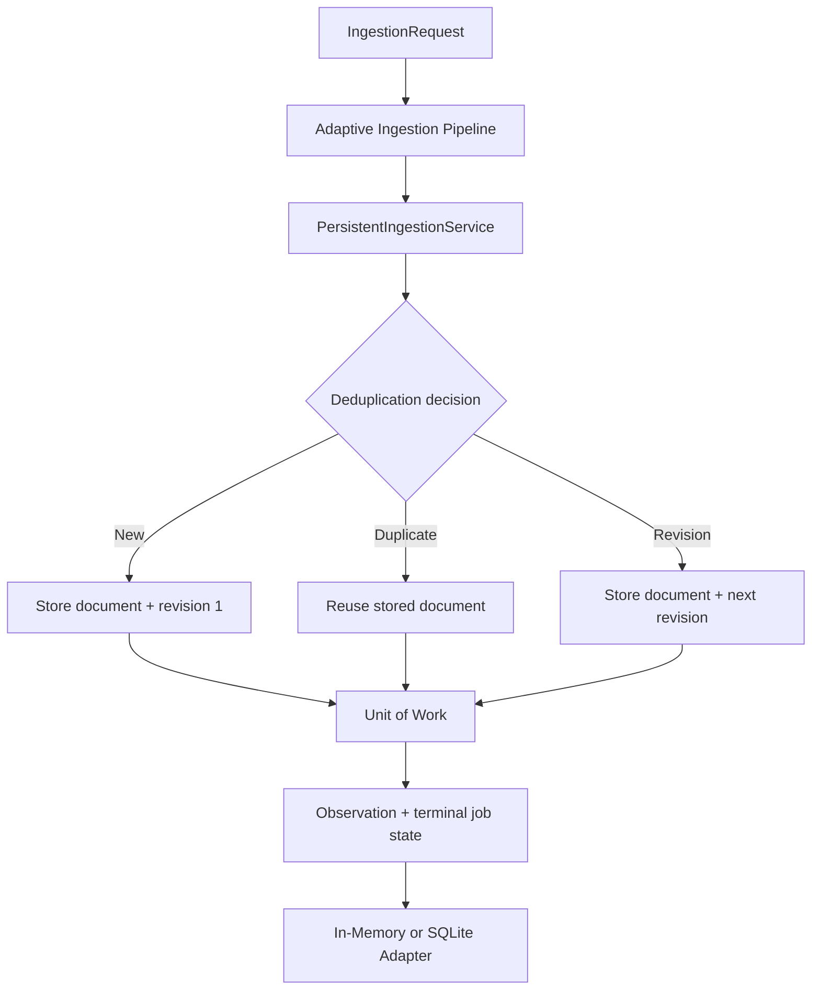

# Persistence Architecture

## Structure



Application code depends on repository interfaces, not SQLite. The adapters
implement the same `PersistenceRepositories` and `UnitOfWork` contracts.

## Data model

### `source_documents`

- `storage_id` primary key
- `domain_document_id`
- `fingerprint` unique
- nullable `canonical_url`
- validated `source_document_json`
- creation/update timestamps

### `ingestion_jobs`

Tracks one pipeline attempt. Allowed states:

```text
pending → running → succeeded
                  → duplicate
                  → failed
```

Terminal states cannot return to running or transition to another terminal
state.

### `document_observations`

Stores one observation for every successful pipeline result, including exact
duplicates. It links a job and stored document and contains only a bounded trace
summary.

### `document_revisions`

Stores the ordered history for one canonical URL. `(canonical_url,
revision_number)` is unique. Revision 1 has no previous document; later
revisions reference the preceding stored document.

## Repository ports

- `SourceDocumentRepository`
- `IngestionJobRepository`
- `DocumentObservationRepository`
- `DocumentRevisionRepository`
- `UnitOfWork`

To add an adapter, implement these contracts, validate all read/write models
with the public persistence schemas, preserve fingerprint/revision uniqueness,
and run the shared repository contract suite.

## SQLite migration usage

Opening `SqlitePersistenceAdapter` automatically applies pending migrations:

```ts
const adapter = new SqlitePersistenceAdapter("./data/world-news-ai.sqlite");
console.log(adapter.schemaVersion);
```

Migration behavior:

- empty database: create schema version 1;
- current database: no-op;
- older supported database: apply pending versions transactionally;
- newer database: fail with `MIGRATION_FAILED`;
- failed migration: rollback.

The application must close the adapter during shutdown:

```ts
adapter.close();
```

## Test database usage

Use isolated in-memory storage:

```ts
const adapter = new SqlitePersistenceAdapter(":memory:");
```

Use a unique temporary file when testing reopen/durability behavior. Tests must
close adapters before removing files. Production data paths must be explicit;
the adapter does not invent a default path.

## Concurrency

SQLite transactions use `BEGIN IMMEDIATE`, a busy timeout, and a unique
fingerprint index. Lookup is an optimization, not the concurrency guarantee.
The unique constraint is authoritative, and the application converts a lost
insert race into a duplicate result while still recording the job and
observation.

Distributed locking and multi-server coordination are outside Sprint 06.

## Security and retention

- all SQL is static and parameterized;
- SourceDocument JSON is runtime-validated on write and read;
- raw bodies and complete traces are not stored in audit tables;
- persisted identity URLs retain ordinary query identity while removing
  tracking/sensitive parameters; observation URLs redact sensitive values;
- low-level database errors and connection details are not returned;
- no delete API or automatic retention engine is included.
