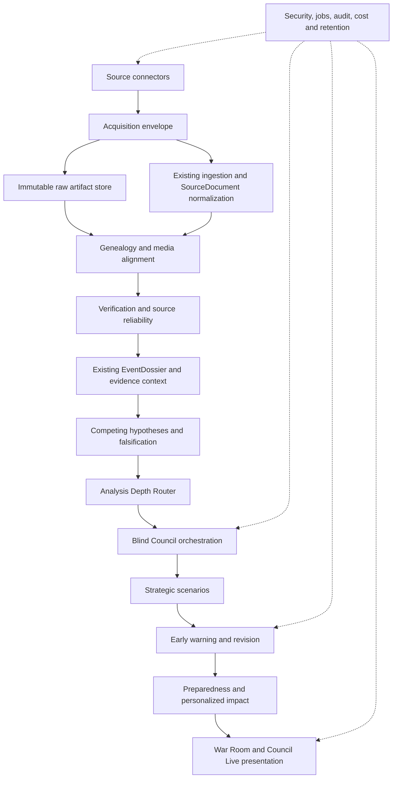

# Strategic Intelligence Target Architecture

## Status

**TARGET DESIGN — NOT IMPLEMENTED**

This document records the Sprint 17.0 compatibility target. It does not
authorize a production connector, strategic model, provider call, scheduler,
or UI implementation.

## Layer map

## Boundary decisions

1. A `SourceConnector` acquires bytes and metadata. It does not classify truth,
   score ideology, create claims, or build a dossier.
2. The acquisition envelope preserves retrieval identity, connector identity,
   content hash, media type, timestamps, access policy result, and a reference
   to raw bytes. Existing `IngestionRequest` remains the normalization input.
3. `SourceDocument` remains the normalized document contract. It must not be
   expanded into an unbounded raw-blob or credential container.
4. Genealogy records derivation, repost, quote, translation, and edit lineage.
   It prevents repeated copies from being counted as independent evidence.
5. Verification records observations and methods. Source reliability is a
   separate, versioned assessment; neither becomes truth or hypothesis
   strength.
6. `EventDossier`, `EvidenceLink`, `EvidenceContextPackage`, excerpts, and
   provenance remain the evidence spine. New layers reference their identities
   rather than copying bodies.
7. Hypothesis strength is assessed from supporting, contradicting, missing,
   and falsifying evidence. It is orthogonal to statement epistemic type,
   source reliability, political/value posture, and user impact.
8. The router selects bounded analysis depth from risk, ambiguity, evidence
   sufficiency, freshness, cost, and user intent. It cannot relax validation.
9. Council agents receive isolated contexts, evidence partitions, and tool
   capabilities. Their outputs are strict `CouncilStatement` records, never
   hidden chain-of-thought.
10. Strategic scenarios are system-level branches with leading indicators and
    invalidation conditions. They do not reuse Sprint 16 personal-impact
    scenarios as the strategic aggregate.
11. Numerical probabilities are absent until a separately approved calibrated
    method supplies provenance, evaluation, and update rules.
12. Preparedness produces reversible, non-transactional readiness options and
    monitoring actions. It does not produce trades, allocations, or execution.
13. Council Live and War Room render validated statements, evidence, dissent,
    scenario deltas, and alerts. UI state is never semantic authority.

## Cross-cutting prerequisites

- resolver-aware DNS rebinding defense and connection pinning;
- connector-scoped credentials and least-privilege tool policies;
- raw-content retention, redaction, deletion, encryption, and access audit;
- prompt-injection treatment of every acquired payload as data;
- idempotent jobs, retries, rate limits, cancellation, cost budgets, and dead
  letter handling;
- provider data-use, residency, logging, and fallback policies;
- immutable semantic lineage separated from operational run identity;
- dependency, secret, license, and production vulnerability scanning.

## Non-merger rules

- Source reliability is not hypothesis strength.
- Epistemic type is not political/value posture.
- Value assessment is not risk assessment.
- Personal impact is not strategic scenario likelihood.
- Preparedness is not investment advice.
- CouncilStatement is not chain-of-thought.
- Multi-provider availability is not agent independence.
- Reposts are not independent corroboration.

