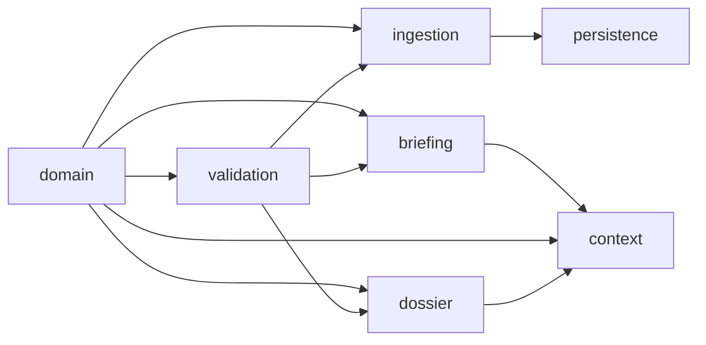

# System Architecture Baseline

## Module inventory

| Module | Role | Input → Output | Direct dependencies | Persistence | Extension point | Not implemented |
|---|---|---|---|---|---|---|
| `domain` | Pure event/evidence contracts | typed records → typed records | none | no | additive domain types | storage, HTTP, UI, LLM |
| `validation` | Runtime domain boundary | unknown → validated domain record | domain, Zod | no | new schemas | normalization |
| `ingestion` | Adaptive source conversion | URL/raw content → SourceDocument | domain, validation, Cheerio, injected fetch | no | capability registry, fetch port | discovery, scheduling |
| `persistence` | Durable ingestion lifecycle | ingestion request → stored/duplicate/revision | ingestion, validation, `node:sqlite` adapter | memory/SQLite | repository/UoW ports | knowledge graph store |
| `dossier` | Evidence assessment aggregate | event + referenced records → revision | domain, validation | memory/SQLite | repository/UoW ports | prose generation, NLP contradiction |
| `briefing` | Question scope contract | BriefingQuestion → intent + contract | Zod, crypto | port only | analyzer/session ports | LLM analysis, rendering |
| `context` | Evidence selection | ready contract + records → context package | domain, dossier port, briefing, Zod | port only | candidate/package ports, scorer | search/discovery, generation |
| `integration` | Baseline verification | fixed fixtures → pipeline assertions | public module contracts | memory | scenario fixtures | external services |

## Dependency direction

Infrastructure libraries remain at adapter/boundary modules:

- Cheerio: generic HTML ingestion capability only.
- `node:sqlite`: SQLite persistence adapters and migrations only.
- Zod: runtime boundaries.
- No LLM SDK, UI framework, vector database, or network client dependency.

## Public contracts

Module `index.ts` files export their public contracts and services:

- Domain: Source, Article, Event, Entity, Topic, Analysis, SourceDocument,
  Claim, EvidenceLink, DataPoint.
- Dossier: EventDossier, statements, confidence, completeness, revisions.
- Briefing: BriefingQuestion, intent analysis, BriefingContract and schemas.
- Context: RetrievalPlan, EvidenceCandidate, SourceExcerpt,
  EvidenceContextPackage, coverage, gaps, providers, and schemas.

## Port and adapter boundaries

- Ingestion receives fetch through resolver options and extraction through
  capability registration.
- Persistence and dossier application services depend on repository/UoW ports.
- Context depends on `EvidenceCandidateProvider`, not SQLite.
- Future AI analysis implements `QuestionIntentAnalyzer`.
- Future ExplanationPlan consumes BriefingContract + EvidenceContextPackage.

## Invalid dependency rules

Domain must not import infrastructure or application modules. Dossier and
briefing must not depend on UI/LLM providers. Context must not perform answer
generation or unrestricted retrieval. Renderers must not rewrite evidence or
contract scope.
