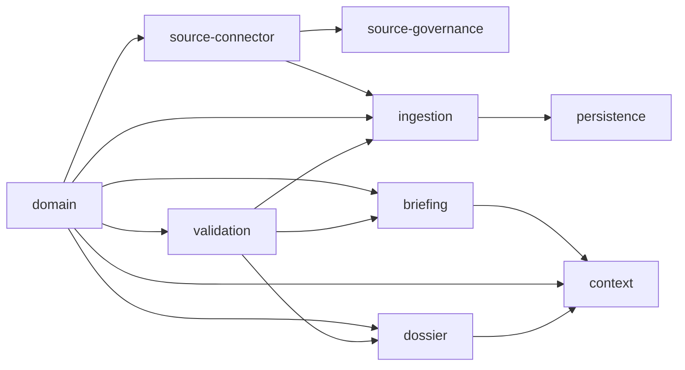

# System Architecture Baseline

Sprint 14.3B Web integration is implemented, browser accepted, and final
complete within the fixture-only boundary.

## Module inventory

| Module | Role | Input → Output | Direct dependencies | Persistence | Extension point | Not implemented |
|---|---|---|---|---|---|---|
| `domain` | Pure event/evidence contracts and URL identity policy | typed records → typed records | none | no | additive domain types | storage, HTTP, UI, LLM |
| `validation` | Runtime domain boundary | unknown → validated domain record | domain, Zod | no | new schemas | normalization |
| `source-connector` | Platform-neutral source acquisition contract | typed locator/request → acquired text/reference or safe failure | domain URL identity, ingestion request type, Zod; crypto for semantic identity | no | connector port, locator union, bridge | live network, credentials, raw storage, media processing, evidence |
| `source-governance` | Raw artifact lifecycle and credential-reference policy | raw reference + policy + operation context → fail-closed access decision | source-connector contracts, validation, crypto for semantic policy identity | no | policy evaluator, availability-only credential resolver port | network enforcement, secrets, encryption, raw storage, deletion execution |
| `ingestion` | Adaptive source conversion | URL/raw content → SourceDocument | domain, validation, Cheerio, injected fetch | no | capability registry, fetch port | discovery, scheduling |
| `persistence` | Durable ingestion lifecycle | ingestion request → stored/duplicate/revision | ingestion, validation, `node:sqlite` adapter | memory/SQLite | repository/UoW ports | knowledge graph store |
| `dossier` | Evidence assessment aggregate | event + referenced records → revision | domain, validation | memory/SQLite | repository/UoW ports | prose generation, NLP contradiction |
| `briefing` | Question scope contract | BriefingQuestion → intent + contract | Zod, crypto | port only | analyzer/session ports | LLM analysis, rendering |
| `context` | Evidence selection | ready contract + records → context package | domain, dossier port, briefing, Zod | port only | candidate/package ports, scorer | search/discovery, generation |
| `explanation` | Evidence-grounded generation plan | contract + context package → validated plan | briefing, context, Zod | port only | generator/repository ports | prose, LLM, renderer |
| `generation` | Untrusted structured provider boundary | question + contract + context → validated plan + audit | briefing, context, explanation, Zod; OpenAI SDK in adapter only | port only | provider/audit/cache ports | final prose, tools, live-by-default calls |
| `script` | Renderer-neutral briefing sequence | validated plan + contract + context + preference → validated script | briefing, context, explanation, Zod | port only | compiler/repository ports | UI, map SDK, motion timing, final prose |
| `session` | UI-independent briefing lifecycle | Script identity + command → session transition | script preference contract, Zod, crypto | memory port only | repository/effect adapters | React, MapLibre, live replan, SQLite |
| `follow-up` | Bounded deterministic follow-up classification | request + captured identity context → replan decision | briefing fingerprint, script preference, Zod | none | classifier policy | LLM, retrieval, prose |
| `replan` | Fixture-only answer/replacement preparation | decision + injected synthetic fixture → validated result | follow-up, session, script validator, Zod | none | ReplanAdapter port | live replan, network, SQLite |
| `application/follow-up` | Follow-up execution and outcome orchestration | session + request + adapter → validated application outcome | session, follow-up, replan, script fingerprint, Zod | none | orchestrator dependencies | React, HTTP, storage |
| `apps/web` | Fixture-only interactive renderer and follow-up controller | validated script + Composer input → synchronized Session/presentation/outcome UI | React, Vite, MapLibre; browser-safe core contracts | none | map adapter, runtime context, fixture resolver, surfaces | backend, live generation, auth |
| `integration` | Baseline verification | fixed fixtures → pipeline assertions | public module contracts | memory | scenario fixtures | external services |

## Dependency direction

```mermaid
flowchart LR
  D["domain"] --> V["validation"]
  D --> SC["source-connector"]
  SC --> SG["source-governance"]
  SC --> I["ingestion"]
  D --> I["ingestion"]
  V --> I
  I --> P["persistence"]
  D --> E["dossier"]
  V --> E
  D --> B["briefing"]
  V --> B
  B --> C["context"]
  D --> C
  E --> C
```

Infrastructure libraries remain at adapter/boundary modules:

- Cheerio: generic HTML ingestion capability only.
- `node:sqlite`: SQLite persistence adapters and migrations only.
- Zod: runtime boundaries.
- No LLM SDK, UI framework, vector database, or network client dependency.

## Public contracts

Module `index.ts` files export their public contracts and services:

- Domain: Source, Article, Event, Entity, Topic, Analysis, SourceDocument,
  Claim, EvidenceLink, DataPoint, and shared URL identity/sanitization policy.
- Dossier: EventDossier, statements, confidence, completeness, revisions.
- Briefing: BriefingQuestion, intent analysis, BriefingContract and schemas.
- Context: RetrievalPlan, EvidenceCandidate, SourceExcerpt,
  EvidenceContextPackage, coverage, gaps, providers, and schemas.
- Explanation: plan draft/validated boundaries, sections, steps, bindings,
  epistemic/visual policies, validator, generator port, and rule assembler.
- Script: presentation preferences, scenes, content bindings, semantic visual
  and camera intents, playback/interaction/accessibility policies, compiler,
  validator, coverage, and fingerprints.
- Session: BriefingSession lifecycle, strict commands/events, deterministic
  reducer, semantic fingerprints, audit metadata, and repository port.
- Follow-up/Replan: normalized requests, bounded context allowlists,
  deterministic decisions, fixture-only results, continuity, and mapping.
- Application Follow-up: ordered execution, append budget, normal resolution,
  stale isolation, rollback, strict outcomes, and UI-action projections.

## Port and adapter boundaries

- Ingestion receives fetch through resolver options and extraction through
  capability registration.
- Source connectors acquire content behind a strict platform-neutral port. The
  bridge projects validated text/HTML acquisition into the existing
  `IngestionRequest`; it does not replace normalization or persistence.
- Source governance attaches lifecycle policy by artifact/policy identity and
  evaluates access fail-closed. It does not resolve secrets, encrypt bytes, or
  persist/delete raw content.
- Source acquisition security authorizes access before any raw artifact exists,
  validates the complete DNS/IP target set, and issues an immutable approved
  egress capability. Node transport must use only its pinned address, preserve
  original-host HTTP/TLS identity, disable connection reuse, and verify the
  connected peer address before accepting a response.
- Persistence and dossier application services depend on repository/UoW ports.
- Context depends on `EvidenceCandidateProvider`, not SQLite.
- Future AI analysis implements `QuestionIntentAnalyzer`.
- ExplanationPlan consumes BriefingContract + EvidenceContextPackage.
- Future structured generators must return the same draft schema and pass the
  same validator.
- BriefingScript consumes only a validated plan, contract, context package, and
  presentation preference; future motion and renderer adapters consume the
  validated script without changing its evidence scope.
- BriefingSession owns lifecycle and semantic interaction state. The Web player
  retains renderer/playback state.
- Follow-up classification never enters the reducer. Replan adapters prepare
  results; only validated results cross the existing reducer command boundary.
- The outcome orchestrator coordinates effects but does not own domain
  classification, replacement validation, rendering, or persistence.

## Invalid dependency rules

Domain must not import infrastructure or application modules. Dossier and
briefing must not depend on UI/LLM providers. Context must not perform answer
generation or unrestricted retrieval. Renderers must not rewrite evidence or
contract scope. Session must not depend on React, DOM, MapLibre, network, LLM,
SQLite, browser storage, clocks, random generators, or timers. Follow-up and
replan modules preserve the same boundary.

## Interactive Briefing audit checkpoint

The Sprint 10–14 pipeline has been audited through the deterministic fixture
checkpoint. Contract, Context Package, ExplanationPlan, BriefingScript,
BriefingSession, follow-up/replan, application outcome, and Web presentation
identities remain explicit at their boundaries. Replacement application rejects
stale or mismatched identities before committing Session/Script/presentation
state.

The Core fixture replan adapter now compares same-ID scenes by semantic
fingerprint and supplies an actual counterevidence change for current-scene
revision. Common semantic fingerprint canonicalization normalizes Unicode
strings to NFC.

User-operated Chrome acceptance confirms Console/runtime health, expected-only
Network traffic, manual navigation, atomic replacement, route/marker continuity,
and accessibility focus behavior. The Codex Chrome control runtime remained
unavailable because of a local kernel asset path issue; this tooling failure is
separate from the product baseline. See
[Milestone 02 — Interactive Briefing Baseline](../milestones/Milestone-02-Interactive-Briefing-Baseline.md).
