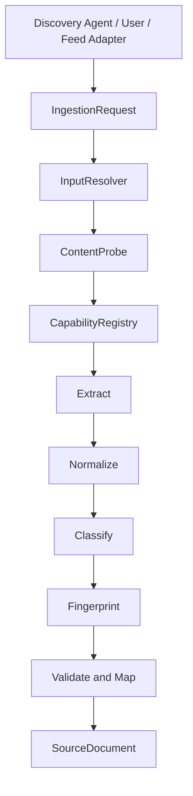

# Sprint-05 — Adaptive Source Ingestion Core

## Goal

Convert URL or UTF-8 content input into a validated `SourceDocument` through a
source-agnostic, capability-based, deterministic pipeline.

## Scope

- URL and raw content requests
- safe, injectable HTTP resolution
- content probing
- capability registration and deterministic selection
- generic static HTML and plain-text extraction
- metadata candidates with confidence and evidence
- normalization, classification, fingerprinting, validation, and mapping
- structured errors and trace

## Architecture



Discovery finds candidate URLs or content. Ingestion inspects and processes a
provided candidate. The ingestion core does not search, crawl, schedule, or
follow page links.

## Inputs

URL:

```ts
{
  kind: "url",
  url: "https://example.com/report",
  hints: { expectedDocumentType: "ResearchReport" }
}
```

Raw content:

```ts
{
  kind: "content",
  content: "Report title\n\nReport body...",
  mediaType: "text/plain",
  sourceUrl: "https://example.com/report.txt",
  hints: {
    expectedLanguage: "en",
    expectedDocumentType: "ResearchReport"
  }
}
```

Hints are evidence candidates. Stronger extracted metadata wins, and conflicts
are included in warnings and trace.

## Pipeline responsibilities

1. `InputResolver` validates input, fetches URL content when required, enforces
   network limits, decodes text, and preserves response metadata.
2. `ContentProbe` combines declaration and content signatures to detect HTML,
   JSON, XML, RSS, Atom, plain text, or unknown input.
3. `CapabilityRegistry` evaluates all registered processors.
4. The selected capability extracts candidates and evidence.
5. Normalization cleans Unicode/control characters/whitespace while retaining
   paragraph boundaries and normalizes dates and canonical URLs.
6. Classification requires a configurable confidence threshold.
7. SHA-256 fingerprinting uses normalized canonical URL, title, and body.
8. Mapping validates with the existing `SourceDocumentSchema`.

## Capability selection

Selection order is match score, explicit priority, then stable capability ID.
Duplicate capability IDs are rejected. A capability can be added by
implementing `IngestionCapability` and registering it through pipeline options:

```ts
new IngestionPipeline({ capabilities: [new CustomCapability()] });
```

Capabilities describe content structures, never named sources.

## Supported inputs and formats

Processed:

- public HTTP(S) URL returning textual content
- UTF-8 raw content
- generic static HTML
- plain text

Detected but not processed:

- JSON
- XML
- RSS
- Atom

Rejected:

- binary and unknown content
- PDF body extraction
- browser-rendered or authenticated content

## Error handling

`IngestionResult` is a discriminated union. Failure includes error code,
message, stage, retryability, safe cause, bounded context, trace, and warnings.
Partially invalid data is never returned as a successful SourceDocument.

## Security

- HTTP(S) only; URL credentials rejected
- literal localhost/private/link-local/metadata addresses rejected
- every redirect destination revalidated
- timeout, redirect count, response size, and retry limits
- explicit User-Agent
- 429 and 5xx bounded exponential retry with injectable delay
- raw content omitted from errors and trace
- DNS-resolution enforcement is a future transport boundary

## Tests

Fixtures cover JSON-LD, Open Graph with semantic article, role=main fallback,
and generic legal-document HTML. Unit tests cover input resolution, URL policy,
redirects, retries, limits, probing, capability selection, extraction,
normalization, classification, mapping, fingerprinting, and Sprint 00–04
regression through the full test suite.

## Out of scope

- search engines and source discovery
- source-specific parsers or collectors
- crawling, sitemaps, queues, workers, scheduling, and databases
- AI/LLM extraction and automatic Claim/DataPoint/Event creation
- PDF, OCR, video, browser rendering, and authentication
- production deployment

## Next Sprint considerations

- resolver-aware DNS/address enforcement
- JSON/feed capabilities
- persistent Source resolution rather than deterministic placeholder source ID
- deduplication storage using fingerprints
- explicit Article-to-SourceDocument migration adapters
