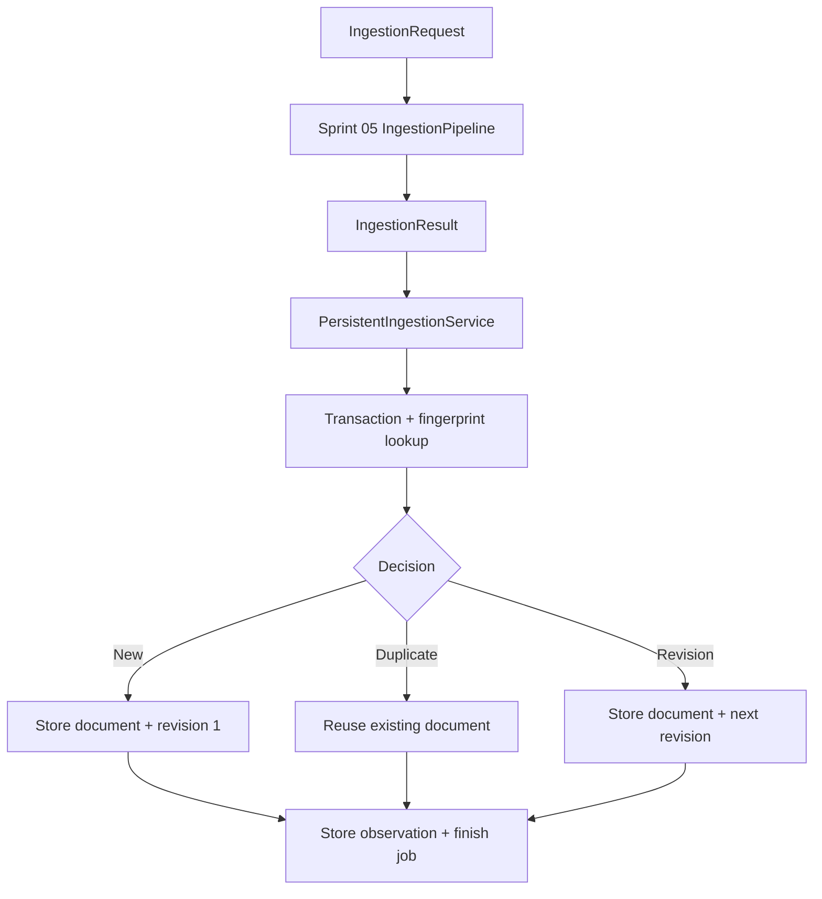

# Sprint-06 — Persistent Ingestion and Deduplication

## Goal

Persist Sprint 05 `SourceDocument` output, distinguish duplicates from
revisions, retain every successful observation and all job outcomes, and keep
application logic independent of storage technology.

## Scope

- persistence-specific models and Zod schemas
- repository ports and Unit of Work
- In-Memory and SQLite adapters
- transactional schema migration version 1
- persistent ingestion application service
- fingerprint uniqueness and race recovery
- canonical URL revision history
- ingestion job state machine
- bounded observation trace summaries
- repository contract, integration, concurrency, and migration tests

## Persistence pipeline

## Decision rules

| Fingerprint | Canonical URL | Outcome |
|---|---|---|
| Existing | Any | `duplicate`; reuse document |
| New | Existing | `revision`; next revision number |
| New | New | `stored`; revision 1 |

Every successful pipeline execution creates an observation. Duplicate document
payloads are not inserted twice.

## Job state

Only these transitions are allowed:

- `pending → running`
- `running → succeeded`
- `running → duplicate`
- `running → failed`

Pipeline failures and persistence failures finish the job as failed whenever
job storage remains available.

## Storage adapters

`InMemoryPersistenceAdapter` supports fast isolated tests and development.
`SqlitePersistenceAdapter` is the durable implementation. Both pass the same
repository contract tests.

SQLite is provided by Node 24 `node:sqlite`, so no ORM, native addon, or database
server dependency is added.

## Schema and migrations

Migration version 1 creates:

- `source_documents`
- `ingestion_jobs`
- `document_observations`
- `document_revisions`
- `schema_migrations`

It also creates the fingerprint unique constraint, job-status index,
canonical-URL indexes, observation lookup indexes, revision unique constraint,
foreign keys, and status/value checks.

## Error and privacy policy

- persistent results expose code, stage, and retryability only;
- database messages, paths, credentials, raw content, and full traces are not
  returned;
- URL policy was superseded by ADR-007: identity retains ordinary query
  parameters while logs redact sensitive values;
- SourceDocument JSON is validated on every write and read.

## Tests

- shared repository contract for both adapters
- transaction rollback
- state-machine transitions
- SQLite migration/reopen/schema version
- persisted JSON corruption
- first storage, duplicate, mirror observation, revision, and unrelated document
- pipeline and persistence failures
- fingerprint race recovery
- eight near-concurrent duplicate requests
- all Sprint 00–05 regression tests

## Out of scope

- discovery, crawling, feeds, queues, workers, scheduler, and cron
- distributed locks and multi-server deployment
- PostgreSQL or cloud databases
- search indexes and vector databases
- AI extraction and automatic event linking
- retention/deletion engine
- PDF/OCR/video/browser rendering

## Next Sprint considerations

- resolver-aware SSRF/DNS enforcement from Sprint 05 debt
- background job claiming and retry scheduling
- explicit retention and deletion policy
- PostgreSQL adapter for distributed deployment
- Source repository integration and richer search indexes
