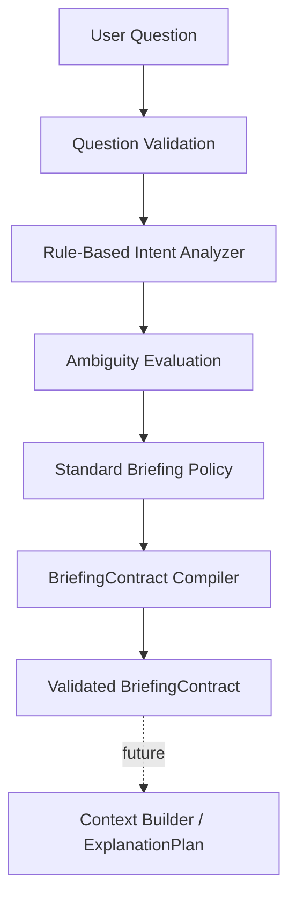

# Sprint 08 — Question Intent & Briefing Contract

## Goal

Convert a validated user question into a deterministic, evidence-first
`BriefingContract` before retrieval, generation, or rendering.

## Delivered

- Strict question, intent, ambiguity, and contract TypeScript/Zod models.
- Korean/English rule-based analysis with primary and secondary intents.
- Explicit ready, clarification-required, and unsupported outcomes.
- Standard scope, evidence, uncertainty, visual, explanation,
  personalization, section, and stop policies.
- Timestamp/ID-independent semantic contract fingerprint.
- Future analyzer and session repository extension ports.

## Out of scope

LLM/API calls, answer generation, retrieval/discovery, semantic search,
`ExplanationPlan`, renderers, UI, portfolio calculations, and SQLite session
persistence are intentionally excluded.
