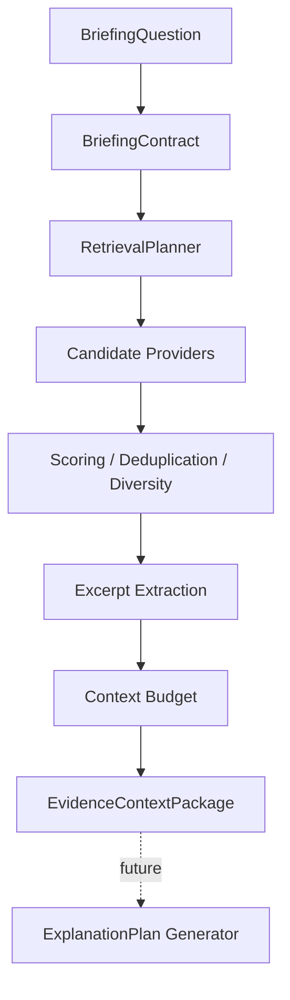

# Sprint 09 — Evidence Retrieval & Context Builder

## Goal

Turn a ready `BriefingContract` into a bounded, provenance-complete
`EvidenceContextPackage` using only stored or explicitly supplied records.

## Delivered

- Contract-driven `RetrievalPlan` with deterministic fingerprint.
- In-memory and repository-backed candidate providers.
- Caller-record hydration for SourceDocument, Claim, EvidenceLink, DataPoint,
  and Entity.
- Lexical/metadata scoring, stable tie-breaking, deduplication, source
  diversity, and required-category reservations.
- Unicode-safe, bounded excerpt extraction with offsets and hashes.
- Context budgets, section assignment, coverage, evidence gaps, provenance,
  structured outcomes/errors, and semantic package fingerprints.
- Strict runtime validation and a future package repository port.

## Outcomes

The builder returns `ready`, `partial`, `insufficient-evidence`, or
`no-relevant-context`. Missing evidence is never replaced with generated text.

## Out of scope

LLMs, answer/forecast generation, web search, source discovery, crawlers,
embeddings, vector databases, semantic reranking, ExplanationPlan, UI, and
renderers are excluded.
