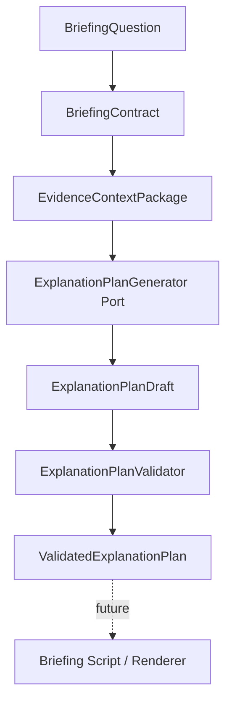

# Sprint 10 — ExplanationPlan Domain & Validator

## Goal

Turn a `BriefingContract` and `EvidenceContextPackage` into a bounded,
evidence-referenced explanation plan. The plan describes what a future
generator must produce; it is not an answer, verdict, forecast, citation
sentence, or renderer program.

## Delivered

- Draft and validated aggregate boundaries.
- Intent-to-answer-strategy mapping and ordered sections/steps.
- Output requirements and explicit epistemic policies.
- Context, excerpt, provenance, source, claim, evidence, data, and entity ID
  bindings.
- Renderer-neutral visual intents and constrained decision rules.
- Contract, context, ordering, DAG, evidence, provenance, epistemic,
  uncertainty, visual, personalization, and stop-condition validation.
- Deterministic semantic fingerprints.
- Provider-neutral generator/repository ports and a deterministic rule-based
  skeleton assembler.
- Structured ready, partial, insufficient, clarification, unsupported, and
  no-plan outcomes.

The rule-based assembler creates plan structure only. A future LLM adapter may
create a schema-compatible draft, but every output must pass the same validator.

## Evidence, insufficiency, and security

Bindings retain IDs only; they never copy the full question, source body, or
excerpt text. Facts require evidence, claims retain attribution, inference is
not promoted to fact, forecasts require assumptions and verification
requirements, and unknowns remain explicit gaps. Weak evidence returns a
structured stop rather than generated filler.

Plans contain no prompt, chain-of-thought, credential, sensitive query,
database path, raw HTML, source body, or direct buy/sell instruction.

## Persistence and out of scope

The repository port is an extension boundary only. No adapter or database
migration is added; SQLite migration remains version 2.

LLM/API calls, prompts, repair calls, final prose, verdicts, forecasts,
briefing scripts, citations, renderer implementation, UI, discovery, crawlers,
embeddings, vector databases, and portfolio calculations are excluded.
