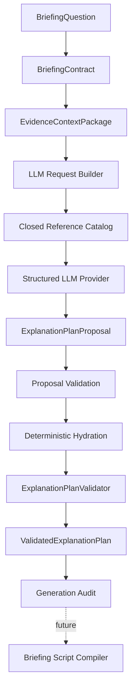

# Sprint 11 — Structured LLM Adapter

## Goal

Treat an LLM as an untrusted structured-plan proposer. Provider output passes
strict proposal parsing, a closed reference allowlist, deterministic hydration,
the Sprint 10 schema, and `ExplanationPlanValidator` before becoming a
validated plan.

## Delivered

- Provider metadata/capabilities and provider-independent port.
- Deterministic fake provider and OpenAI Responses structured adapter.
- Server-only opt-in configuration and safe no-key behavior.
- Bounded request package, prompt version/hash, DATA_ONLY evidence envelope,
  and exact ID allowlist.
- Strict provider-only proposal schema with local references.
- Deterministic domain-ID hydration and semantic plan validation.
- Bounded transport retry, maximum-one repair, refusal outcome, redacted audit,
  and request/proposal/plan fingerprints.

## Security and live-call policy

Tests use fake providers or an injected fake SDK client. Module import,
typecheck, tests, and ordinary application startup make no network request.
Live use requires `WORLD_NEWS_AI_LLM_ENABLED=true`, an API key, a model ID, and
an explicit coordinator call. `.env` files are ignored; `.env.example` contains
empty values only.

Evidence text is preserved but marked `UNTRUSTED_EVIDENCE` and `DATA_ONLY`.
Prompt text instructs the model not to obey embedded instructions. Closed-world
validation rejects every reference not present in the package.

Audit records omit question text, excerpt text, prompts, raw responses, API
keys, headers, stack traces, and chain-of-thought.

## Retry and repair

Transport retry is limited to retryable rate-limit, timeout, and transient
server failures, with bounded exponential backoff. Authentication, permission,
quota, invalid-request, refusal, and abort outcomes are not retried.

Repair is a separate model attempt, allowed at most once for proposal shape,
reference, or semantic errors. It cannot add evidence or weaken validation.
Insufficient evidence, clarification, unsupported requests, and refusal are not
repairable.

## Persistence and exclusions

Audit/replay repository ports are defined without adapters. SQLite migration
remains version 2. Final prose, verdicts, forecasts, model-created
probabilities, web discovery, tools, streaming, scripts, renderers, UI, maps,
charts, strategic foresight models, portfolio calculations, and live smoke
tests are excluded.

Sprint 12 may begin when this offline structured boundary remains green and a
Briefing Script Compiler consumes only `ValidatedExplanationPlan`.
