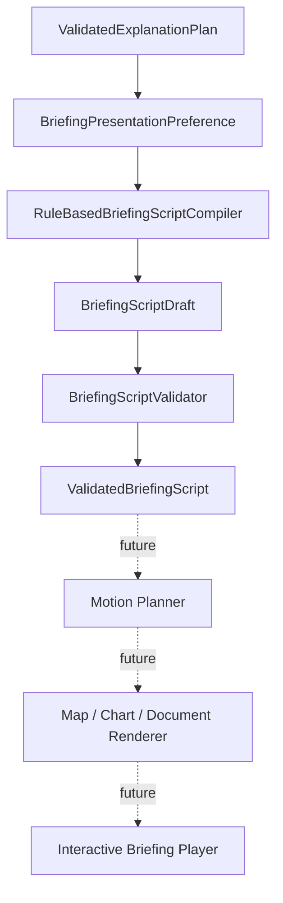

# Sprint 12 — Briefing Script Domain & Compiler

## Goal

Compile a `ValidatedExplanationPlan` into a strict, renderer-independent scene
script. The script specifies presentation intent, evidence, narration
requirements, interaction, safe layout, and accessibility without containing
final prose or renderer implementation.

## Delivered

- Presentation modes: auto, cinematic map, map/chart, chart-led,
  document-led, static, and reduced motion.
- Scene aggregate with plan/evidence bindings, visual/camera/overlay/chart/
  document intent, narration/caption requirements, citations, uncertainty,
  layout, timing, transitions, interaction, and accessibility.
- Fixed bottom-center composer, playback-control transition, focus pause, user
  viewport preservation, and mobile safe-area policy.
- Deterministic compiler, semantic validator, dependency DAG checks,
  structured outcomes, coverage, repository port, and fingerprint.

## Boundaries

The script contains no coordinates, zoom, speed, duration, easing, SVG, CSS,
HTML, WebGL, framework component, chart specification, audio, final answer,
final narration, or chain-of-thought. Motion Planner and renderers remain
future boundaries. SQLite migration remains version 2.

Tests are offline and use the deterministic structured provider. Sprint 13 may
start by consuming only `ValidatedBriefingScript`.
